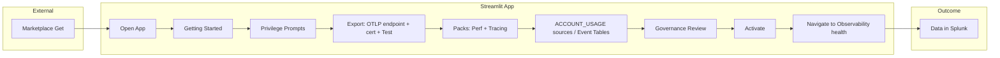
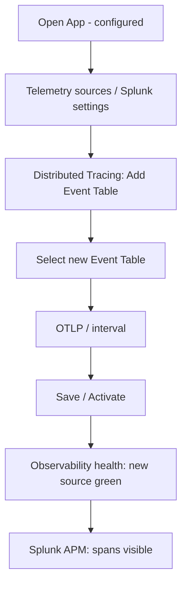
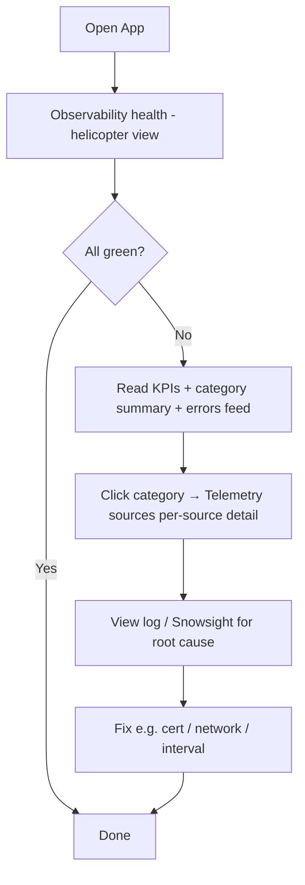
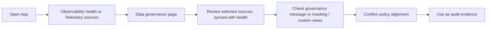

# UX Design Specification snowflake-native-splunk-app

**Author:** Nik
**Date:** 2026-02-22

---

<!-- UX design content will be appended sequentially through collaborative workflow steps -->

## Executive Summary

### Project Vision

Splunk Observability for Snowflake is a zero-infrastructure Snowflake Native App that exports rich telemetry (traces, metrics, logs, and events) to Splunk. It provides a frictionless "install, configure, and observe" experience entirely within the consumer's Snowflake account, acting as a secure, governed data bridge without the need for external collectors or custom ETL pipelines. The UI will strictly adhere to Snowflake Native App Streamlit constraints, ensuring top-tier security and performance.

### Target Users

- **Maya (Snowflake Platform Admin):** Seeks zero-maintenance telemetry export and proactive Splunk alerting. Demands strict adherence to existing Snowflake data governance policies.
- **Ravi (Site Reliability Engineer):** Needs end-to-end distributed tracing that penetrates the Snowflake boundary to resolve incidents rapidly without context-switching.
- **Sam (DevOps Engineer):** Needs clear, at-a-glance pipeline health metrics and structured logs to debug export or transport issues.

### Key Design Challenges

- **Designing within Streamlit CSP Boundaries:** We rely on verified compatible native components (e.g. `st.columns`, `st.container`, `st.dataframe` with `column_config`). **Inline** custom HTML, CSS, and JS are supported via `st.markdown(unsafe_allow_html=True)` and `st.html()` for targeted enhancements; external CSS, fonts, scripts, and CDN assets remain blocked, as outlined in the component compatibility matrix and `streamlit_snowflake_design_rules.mdc`.
- **Simplifying Complex Configurations:** Translating technical requirements (Event Table binding, OTLP endpoint setup) into an intuitive, guided onboarding flow.
- **Communicating Security & Trust:** Visually reassuring admins that their Snowflake-native governance policies (masking, row access) are actively enforced on outgoing telemetry.

### Design Opportunities

- **Frictionless Onboarding:** Optimizing the "Time to First Value" so users can route data to Splunk in under 15 minutes using clear, linear setup flows.
- **Modern Component Usage:** Utilizing the latest compatible Streamlit components (e.g., `st.pills`, `st.segmented_control`, and native metrics) to create a tactile, iOS-like configuration experience that feels native to Snowsight.
- **Clear Health Visualization:** Building a Pipeline Health dashboard that instantly communicates system state, partial successes, and transient errors using only native data display components without overwhelming the user.

## Core User Experience

### Defining Experience

The core user experience centers around **frictionless configuration and immediate observability**. The absolute most important action—and the one that defines the product's success—is **binding sources (Event Tables and ACCOUNT_USAGE views) and configuring the OTLP export destination**. If we nail this configuration wizard, making it feel less like a complex ETL setup and more like a simple "turn on" switch, users will achieve their "aha!" moment (data flowing into Splunk) in under 15 minutes. Once configured, daily usage shifts to monitoring Pipeline Health, which must be scannable in seconds.

### Platform Strategy

This is exclusively a **Streamlit in Snowflake Native App**, meaning it will be accessed via desktop web browsers within the Snowsight interface. The platform strategy prioritizes built-in Streamlit 1.52.2+ components for layout, state, and feedback (e.g. `st.columns`, `st.container(border=True)`, `st.pills`, `st.segmented_control`). **Inline** custom HTML/CSS/JS via `st.markdown(unsafe_allow_html=True)` and `st.html()` is supported for targeted polish (e.g. colored labels, subtle spacing, self-contained snippets); external CSS, fonts, scripts, and third-party charting components remain blocked by CSP.

### Effortless Interactions

- **Privilege Binding:** Instead of asking administrators to run complex, manual SQL scripts to grant privileges, we will use the Python Permission SDK to trigger native Snowsight prompts. 
- **Monitoring Pack Selection:** Selecting what telemetry to export should be as simple as flipping a toggle switch (`st.toggle`) or selecting a pill (`st.pills`) rather than writing complex data mapping rules.
- **Stream Auto-Recovery:** If a stream goes stale, the app recovers it automatically. The interaction is effortless because it requires *zero* user intervention.

### Critical Success Moments

- **The Admin's First Alert (Maya):** The moment she receives a Splunk alert about a warehouse credit spike *before* anyone on the analytics team notices.
- **The SRE's First Connected Trace (Ravi):** The moment he clicks on a slow span in his Splunk APM trace waterfall and realizes it's a Snowflake UDF, complete with warehouse name and query ID attributes natively attached.
- **The "Leverage, Don't Replicate" Realization:** When the security team sees the **Data governance** page and understands that selecting custom views as sources lets their existing Snowflake masking and row-access policies apply to outgoing telemetry; when default sources are selected, the app informs them that custom views are required for governance.

### Experience Principles

- **Zero-Friction "Time to First Value":** Keep the setup linear, clearly guided, and strictly under 15 minutes.
- **Native by Design:** Look and feel like a seamless extension of Snowsight, embracing Streamlit's component limitations as a strength for UI consistency.
- **Trust through Transparency:** Clearly communicate health, data gaps, and governance states so users never have to guess what data is leaving their account.
- **Leverage, Don't Replicate:** Never ask the user to configure privacy rules in the app if they can, and should, configure them at the Snowflake platform layer.

## Desired Emotional Response

### Primary Emotional Goals

**Confident Empowerment.** 
Administrators and engineers should feel completely in control of their observability data. Connecting Snowflake telemetry to Splunk has traditionally been a high-friction, opaque process. This app should replace that friction with the empowering realization that setting up a secure, governed data bridge takes less than 15 minutes.

### Emotional Journey Mapping

- **Discovery & Installation:** *Relief and Curiosity.* Users are relieved to find a solution that requires zero external infrastructure, sparking curiosity about how quickly they can get it running.
- **Configuration:** *Trust and Clarity.* As they navigate the Streamlit setup wizard, the explicit visibility into Governance (masking/row access policies) replaces skepticism with deep trust.
- **Completion (The "Aha!" Moment):** *Delight.* Seeing the first distributed trace or warehouse metric appear in Splunk creates a moment of genuine delight and professional satisfaction.
- **Ongoing Operations:** *Calm Assurance.* The Pipeline Health dashboard and auto-recovery mechanisms ensure that ops engineers feel calm and supported, knowing the system handles transient errors transparently.

### Micro-Emotions

- **Trust > Skepticism:** Fostered by the Data governance page showing selected sources and clear guidance when default sources are used (custom views required for governance).
- **Confidence > Confusion:** Fostered by a linear, constrained UI that only uses approved native Streamlit components (no complex custom code blocks to configure).
- **Relief > Frustration:** Fostered by clear, structured operational logs and auto-recovery notifications rather than silent failures.

### Design Implications

- **Design for Trust:** Use clear, native callout components (`st.info`, `st.warning`, `st.error`) to communicate system state and governance status transparently. Never hide configuration details.
- **Design for Confidence:** Utilize structured layouts (`st.columns`, `st.container(border=True)`) to break the configuration process into digestible, card-based steps. Use clear, modern selection widgets (`st.pills`, `st.segmented_control`) instead of overwhelming dropdowns where possible.
- **Design for Relief:** When an error occurs or a stream auto-recovers, use native status elements (`st.metric` deltas, `st.toast`) to inform the user calmly, ensuring they always know *why* something happened and that it is handled.

### Emotional Design Principles

1. **Clarity over Cleverness:** In a data governance context, predictability builds trust.
2. **Celebrate the Milestone:** Reaching the end of the configuration wizard is a massive win; the UI should acknowledge this success clearly.
3. **Respect the Admin's Time:** Every click saved, and every log made queryable, is a sign of respect for the user's operational burden.

## UX Pattern Analysis & Inspiration

### Inspiring Products Analysis

- **Snowsight (Snowflake's UI):** The gold standard for our context. It utilizes clean, function-first layouts, segmented controls for data filtering, and high-density data tables. Our app must feel like a natural extension of this environment.
- **Splunk Data Inputs Wizard:** Excels at linear, step-by-step configuration of complex data routing. It validates connections early and prevents users from moving forward with broken configurations.
- **Modern Dev Tools (e.g., Vercel, Stripe):** Master the "Settings Card" UI, grouping related configurations logically within bounded containers, and using highly visible, color-coded status badges for system health.

### Transferable UX Patterns

- **The Card-Based Layout:** Utilizing `st.container(border=True)` to create distinct visual zones for each configuration step (e.g., one card for "Distributed Tracing Pack", another for "Splunk Destinations").
- **Clear task progression:** Using a Getting Started hub with tiles (drill-down to Splunk settings, Telemetry sources, etc.) so "Time to First Value" is broken into bite-sized tasks; within each destination, `st.tabs` or `st.container` blocks keep the UI focused.
- **Scannable Status Indicators:** Using the latest `st.pills` and native metrics (`st.metric` https://docs.streamlit.io/develop/api-reference/data/st.metric) to provide an at-a-glance view of Pipeline Health and Governed View masking states. 

### Anti-Patterns to Avoid

- **The "Wall of Toggles":** Un-grouped, flat lists of configuration options that cause cognitive overload.
- **Silent/Opaque Failures:** Generic error states. We must surface specific, actionable error messages using `st.error` and `st.warning`.
- **External CSS/Resource Hacking:** Loading external stylesheets, fonts, or scripts from CDNs is blocked by CSP. **Inline** HTML/CSS/JS is allowed; use it sparingly for consistency and maintainability—prefer native components first.

### Design Inspiration Strategy

**What to Adopt:**
- The native Snowsight aesthetic. We will rely entirely on Streamlit's default light theme and native components to ensure perfect integration and CSP compliance.
- Card-based grouping for complex configuration blocks.

**What to Adapt:**
- Splunk's step-by-step wizard logic, adapted into a single-page Streamlit flow using expanding sections (`st.expander`) or tabs to keep the user focused.

**What to Avoid:**
- External component libraries, external fonts, and external CDN-based styling (all blocked by CSP). Rely on native components and, when needed, **inline** custom UI only.

## Design System Foundation

### Design System Choice

**Native Streamlit UI (Strict Compliance Mode)**

The Snowflake Native App CSP blocks **external** CSS, fonts, scripts, and CDN assets. **Inline** custom HTML, CSS, and JS are supported (e.g. `st.markdown(unsafe_allow_html=True)`, `st.html()`); all such content must be self-contained—no external resource links. Our design system is **native-first**: we use built-in Streamlit components for the vast majority of the UI. Inline custom UI is available for targeted enhancements (e.g. colored text, badges, fine-grained spacing) when native options are insufficient; we do not use it to replicate an external brand (e.g. full Splunk Prism theming) or to load external resources.

By adopting "Native Streamlit UI (Strict Compliance Mode)," we achieve three critical goals:
1. **Guaranteed App Approval:** Zero risk of failing Snowflake's security review due to CSP violations.
2. **Native Snowsight Feel:** The app will feel like a built-in Snowflake feature, increasing administrator trust.
3. **High Velocity:** Developers can build the UI using standard Python components without wrestling with custom styling workarounds.

### Implementation Approach (Figma to Streamlit Mapping)

Based on a thorough analysis of the provided Figma design system and `streamlit_snowflake_design_rules.mdc`, we will implement the UI building blocks using strict 1:1 mappings to native Streamlit components. This ensures visual fidelity within the platform's constraints.

- **Containers & Layouts (Figma Node 2149:76731):**
  - *Figma Card:* Implemented as `st.container(border=True)`. This is our primary grouping element for configuration sections.
  - *Grid Layouts:* Implemented using `st.columns()` to create structured, responsive forms.

- **Text Elements (Figma Node 1815:25034):**
  - *Headings & Body:* Implemented using standard Markdown via `st.markdown()`, `st.header()`, and `st.subheader()`. No custom fonts; we inherit the Snowsight default font stack.

- **Data Elements (Figma Node 1819:25181):**
  - *Tables:* Implemented exclusively via `st.dataframe()` configured with `column_config` for specific formatting (e.g., status icons, progress bars, or formatted numbers). We will *not* use `st.table()`, which lacks interactive features.

- **Chart Elements (Figma Node 2043:109671):**
  - *Metrics:* Implemented using `st.metric()` to display pipeline health (e.g., rows exported, error counts) with built-in delta indicators.
  - *Charts:* Implemented using native Streamlit charts (`st.line_chart`, `st.bar_chart`) or Altair (`st.altair_chart`) if complex visualizations are required, as it is a supported library.

- **Buttons (Figma Node 2040:18553):**
  - *Primary/Secondary Actions:* Implemented using `st.button()`. We will use the `type="primary"` argument for the main configuration save action.

- **Selections (Figma Node 2113:9632) & Inputs:**
  - *Radio/Single Choice:* Implemented using `st.radio()` or the newer `st.pills()` for a more modern, compact look when selecting telemetry types.
  - *Multi-Choice:* Implemented using `st.segmented_control()` or `st.multiselect()`.
  - *Toggles:* Implemented using `st.toggle()` for enabling/disabling specific data streams.
  - *Text/Numeric/Date:* Implemented via `st.text_input()`, `st.number_input()`, and `st.date_input()`.

- **Status - Callouts & Other (Figma Nodes 2344:38612, 2368:32006):**
  - *Alerts & Guidance:* Implemented using native callouts: `st.info()`, `st.warning()`, `st.error()`, and `st.success()`. These are critical for communicating governance status and connection errors.

### Visual Language

- **Color Palette:** Primary palette is inherited from the Snowsight light theme. For accents we can use Streamlit's markdown color syntax (≥1.28): `:red[text]`, `:blue[text]`, `:green[text]`, `:orange[text]`, `:violet[text]`, `:gray[text]`. Limited inline CSS for color is allowed where needed; we do not load external themes or CDN styles.
- **Typography:** Inherited natively (no external font loading).
- **Spacing:** Prefer `st.space` (1.51.0+) for vertical/horizontal spacing; otherwise `st.columns`, `st.container`, and native padding. Inline CSS for margins/padding is permitted for fine-grained control when necessary; avoid brittle hacks like `st.write("")` for spacing.

### Custom UI (Inline) Policy

Per `streamlit_snowflake_design_rules.mdc`, **inline** HTML, CSS, and JS are supported in Snowflake Native Apps via `st.markdown(..., unsafe_allow_html=True)` and `st.html()` (1.36.0+). All content must be inline or loaded into a string—no URLs or file paths to external resources. External `<script>`, `<style>`, fonts, and images via CDNs remain blocked. We use inline custom UI only when native components are insufficient (e.g. colored badges, precise spacing, self-contained snippets); the default is native Streamlit components for consistency and maintainability.

### Component Library Strategy

We will not build a custom Python component library wrapping Streamlit elements. Instead, we will establish strict coding guidelines (documented in `streamlit_snowflake_design_rules.mdc`) ensuring developers use the raw Streamlit components consistently according to the mappings defined above, and apply inline custom UI only where justified. This minimizes technical debt and maximizes compatibility with future Snowflake updates.

## Defining Experience & Interaction Mechanics

### 1. Defining Experience

**The Frictionless Connection Wizard.**
The absolute defining experience of this app is allowing a Snowflake Platform Admin to confidently map their Event Tables and Account Usage views to an OTLP export endpoint in under 15 minutes. It replaces error-prone manual infrastructure setup (e.g., custom Snowpipe tasks, AWS/Azure middle-tier collectors) with a few guided clicks entirely inside Snowsight. If we get this configuration flow perfectly right, the ongoing value of the product (observability) naturally follows.

### 2. User Mental Model

Administrators typically approach telemetry export with a mental model of building a "Data Pipeline." They expect a high-friction process involving credential management, network rules, firewall requests, and manual SQL scripts. 

- **Current frustrations:** Existing solutions are brittle, require constant maintenance, and often mean data leaves the secure Snowflake perimeter into an unmanaged middle tier.
- **The mental shift:** Bringing the configuration entirely *inside* Snowflake. Users need to realize they are orchestrating powerful native objects (External Network Access, Secret objects, Governed Views) simply by interacting with familiar Streamlit UI inputs, without writing a single line of SQL.

### 3. Success Criteria

- **Validation at Every Step:** Users feel smart and secure when the UI instantly validates the OTLP connection (test span / reachability check) before letting them proceed.
- **Zero-SQL Setup:** Users say "this just works" when they don't have to manually write `CREATE EXTERNAL NETWORK RULE` or `CREATE SECRET` statements; the app generates the necessary Native App permission prompts.
- **Transparent Governance:** Users are reassured when they see exactly which data is being exported and whether existing Snowflake masking policies are actively applied to those specific columns.
- **Speed to Value:** Time to first successful telemetry export is strictly under 15 minutes.

### 4. Novel UX Patterns

This interaction relies on applying **established patterns in a novel, highly constrained context**. We are taking the familiar "Getting Started" / onboarding pattern (common in modern dev tools like Vercel or Stripe) and implementing it within the strict CSP environment of Snowsight using only native Streamlit components (`st.container`, `st.pills`, `st.button`, `st.tabs`). The novelty lies in utilizing simple, tactile UI widgets to seamlessly orchestrate complex, platform-level security and network objects in the background. Getting Started runs only once; thereafter the app shows Observability health, Telemetry sources, Splunk settings, and Data governance.

### 5. Experience Mechanics

**Getting Started** (one-time onboarding) uses a **tile hub**, not a linear stepper:

**1. Initiation:** 
- The user opens the app from the Snowflake Apps tab. 
- The app detects the "unconfigured" state and presents the **Getting Started page**: a dedicated hub with **big tiles** (cards) for each task and a sidebar progress indicator (e.g. "2/4 tasks" or "50%"). The user chooses which tile to tackle; there is no single "Next" stepper. Each tile links to the task-specific page or section (Splunk settings, Telemetry sources, etc.).

**2. Interaction (hub and drill-down):**
- **Hub:** The Getting Started page shows tiles for: Configure Splunk Settings, Select Telemetry Sources, Review Data Governance, Activate Export. Progress (e.g. completed vs pending) is visible per tile and in the sidebar (e.g. "2/4"). Users complete tasks by **drilling down** from a tile (or via the sidebar) into the corresponding page — they do *not* move through one long linear form.
- **Recommended task order** (the sequence users typically complete, but they can jump via tiles):  
  - *Task 1 — Splunk settings (Export settings tab):* User enters **OTLP endpoint** (gRPC URL with port) pointing to a remote OpenTelemetry collector. Optionally pastes a **PEM certificate**. **Test connection** verifies OTLP reachability; result via `st.status`.  
  - *Task 2 — Telemetry sources:* User selects packs and sources (ACCOUNT_USAGE views / custom views, Event Tables), intervals.  
  - *Task 3 — Governance review:* Read-only display of **selected sources**; app **informs** when default view/event table is selected that masking/row policies require custom views.  
  - *Task 4 — Activate:* User clicks "Enable Auto-Export" (or equivalent); app provisions objects; progress via `st.spinner` or callouts.
- Within each drilled-down page, the UI may use `st.container` blocks or `st.tabs` as appropriate (e.g. Export settings is one tab on the Splunk settings page). The **overall** Getting Started experience remains hub-and-drill-down, not a single linear stepper.

**3. Feedback:**
- Test connection gives immediate feedback (e.g. "Connection failed", "Network Rule blocked", or success). Native Snowsight privilege prompts when binding Event Tables.

**4. Completion:**
- `st.success` and optionally `st.balloons()`. A green completion banner appears: "Setup complete! Navigate to Observability Health to monitor your telemetry pipeline." **No auto-redirect** — user stays on the Getting Started page and manually clicks "Observability health" in the sidebar to navigate away. Observability health shows first green statuses and row counts; data flow is visible. Getting Started is removed from the sidebar once the user navigates away.

## Visual Design Foundation

### Color System

**Native-First Snowsight Palette with Inline Enhancements**
External CSS and CDN-based theming are blocked by CSP. Our base color system is inherited from the **Snowsight Light Theme**. **Inline** custom UI is supported: we may use `st.markdown()` with Streamlit color syntax (≥1.28) and, when needed, inline CSS for accents—all self-contained, no external links.

- **Backgrounds:** Standard Streamlit white/light gray (native).
- **Primary Action Color:** Streamlit's native primary accent (e.g. `st.button(..., type="primary")`).
- **Semantic Status Colors:** Native callouts—`st.success()`, `st.warning()`, `st.error()`, `st.info()`.
- **Text/Label Accents:** `st.markdown()` with `:red[text]`, `:blue[text]`, `:green[text]`, `:orange[text]`, `:violet[text]`, `:gray[text]`; or inline HTML/CSS in `st.markdown(..., unsafe_allow_html=True)` / `st.html()` where a native component does not suffice.

### Typography System

**System-Native Typography**
External font loading (e.g. Google Fonts) is blocked by CSP. We use the default Snowsight typography stack (e.g. `Inter` or `system-ui`). Rich text and limited styling can use `st.markdown()` (including `unsafe_allow_html=True` for inline HTML when needed).

- **Hierarchy:** Native Markdown and Streamlit headers first.
  - `st.header()` for main page sections; `st.subheader()` for card/container titles.
  - `st.markdown()` and `st.write()` for body copy; `st.caption()` for helper text.
  - Where native components are insufficient, inline HTML/CSS via `st.markdown()` or `st.html()` is permitted for typographic emphasis (e.g. badges, small labels).

### Spacing & Layout Foundation

**Streamlit Grid, Containers, and Optional Inline Styling**
Layout is built from Streamlit's structural components. **Inline** CSS is allowed for margins/padding when needed (no external stylesheets).

- **Structural Containers:** `st.container(border=True)` for distinct "cards"; native padding and borders.
- **Grids:** `st.columns()` for multi-column forms and horizontal alignment.
- **Whitespace:** Prefer `st.space` (1.51.0+) for vertical/horizontal spacing; otherwise native component margins. Inline CSS for spacing is permitted for fine-grained control. Avoid brittle patterns like `st.write("")` for spacing.

### Accessibility Considerations

By strictly adhering to the native Streamlit component library, we automatically inherit Snowflake's baseline accessibility standards for contrast ratios, keyboard navigation, and screen reader compatibility. 

- **Interactive Elements:** We will ensure all form inputs (`st.text_input`, `st.selectbox`, etc.) use proper, descriptive label parameters, which Streamlit natively maps to accessible `<label>` HTML tags.
- **Status Communication:** We will not rely on color alone to communicate status; native callout components (`st.error`, `st.success`) include both color and semantic icons by default.

## Design Direction Decision

### Design Directions Explored

Given strict adherence to native Streamlit components, we explored structural layout patterns only (no visual theme variations):

1. **Tabbed Single-Page:** `st.tabs()` for Setup, Governance, and Health in one view.
2. **Expanding Accordion:** `st.expander()` stacking steps vertically on one scrolling page.
3. **Multi-Page App (Sidebar):** `st.navigation()` with sidebar order: Getting started → Observability health → Telemetry sources → Splunk settings → Data governance. After onboarding, Getting started is removed; Observability health is home.
4. **Sequential Stepper:** Session-state-driven wizard with Next/Back and `st.container()` swapping.

### Chosen Direction

**Direction 3: Multi-Page App (Sidebar) with `st.navigation()`**

Navigation is implemented using Streamlit’s native [st.navigation](https://docs.streamlit.io/1.52.0/develop/api-reference/navigation/st.navigation) API. The entrypoint file acts as a router; pages are defined as a list or grouped dictionary, and the current page is run via the returned object’s `.run()` method. The navigation widget appears at the top of the sidebar by default (`position="sidebar"`), which fits our need to separate Splunk settings and Telemetry sources from Observability health without external components or custom CSS.

### Design Rationale

- **Clear separation of tasks:** Setup (one-time or occasional) lives on one page; the Health Dashboard (daily monitoring) on another, reducing the risk of changing connection settings while checking metrics.
- **Native and CSP-safe:** `st.navigation()` is a first-party Streamlit 1.52+ feature, fully supported in Snowflake Native Apps and consistent with our native-only design system.
- **Scalability:** Additional pages (e.g. Governance Review, Logs) can be added as further `st.Page()` entries or callables without changing the overall layout pattern.
- **Fits Snowsight:** Sidebar order (Getting started → Observability health → Telemetry sources → Splunk settings → Data governance) matches common Snowsight patterns and keeps the app feeling like part of the platform.

### Implementation Approach

1. **Entrypoint:** The app entrypoint (e.g. `streamlit_app.py`) calls `st.navigation(pages)` with a list or dict of pages (files or `st.Page()` objects). It then runs the current page with `pg.run()`.
2. **Pages:** Getting started is shown only when at least one onboarding task is left undone. After completion, navigation exposes **Observability health** (home), **Telemetry sources**, **Splunk settings**, and **Data governance**. Getting started uses a tile hub with drill-down to Splunk settings (Export settings tab), Telemetry sources, governance, and activate; it is removed from the sidebar once all tasks are done.
3. **Sections (optional):** Use a dictionary for `pages` to group items (e.g. "Telemetry sources" / "Splunk settings" vs "Observability health" / "Data governance") with labels, as in the [st.navigation docs](https://docs.streamlit.io/1.52.0/develop/api-reference/navigation/st.navigation).
4. **Shared state:** Any widgets that must persist across pages (e.g. sidebar filters) are placed in the entrypoint file and keyed in session state so pages can read them.

## User Journey Flows

We design flows for the critical PRD journeys, mapped to our **Multi-Page App (Sidebar)** structure via `st.navigation()`.

**Onboarding vs. regular app:** **Getting Started** runs until the user has completed all setup tasks AND navigated away from the Getting Started page. The visibility logic is:

- **Getting started visible in sidebar when:**
  - At least one task is incomplete, OR
  - All tasks complete but user is still on the Getting Started page

- **Getting started hidden from sidebar when:**
  - All 4 tasks are complete AND user has navigated to any other page (Observability health, Telemetry sources, etc.)
  - Once hidden, it stays hidden permanently (even when navigating between other pages)

- **First-time open:** → Getting Started page displayed as default
- **After completion + navigation away:** → Direct to **Observability Health** on every subsequent open
- **No auto-redirect:** User stays on Getting Started page after completing all tasks; they must manually click "Observability health" in the sidebar to navigate away

**Sidebar order (top to bottom, exact labels from Figma):** The links users see in the sidebar are, in order:

| # | Label | Streamlit icon | Figma Lucide name | Notes |
|---|---|---|---|---|
| 1 | **Getting started** | `:material/rocket_launch:` | `Rocket` | Shows "X/4" progress badge; visible until all onboarding tasks complete AND user navigates away; then removed |
| 2 | **Observability health** | `:material/dashboard:` | `LayoutDashboard` | Home page after onboarding; active state has dark (#030213) left accent bar |
| 3 | **Telemetry sources** | `:material/database:` | `Database` | Where user selects content packs, sources, and intervals |
| 4 | **Splunk settings** | `:material/settings:` | `Settings` | Where user configures OTLP/gRPC export |
| 5 | **Data governance** | `:material/shield:` | `Shield` | Read-only governance view |

**Sidebar header (from Figma):**
- App name: **"Splunk Observability"**
- Subtitle: **"for Snowflake"**

**Sidebar footer (from Figma node 4499:49308):**
- An **"About"** link with an `:material/info:` icon (Figma: `Info` — circle-i). Text: "About" (Inter Medium, 12px, muted #717182). Clicking it opens a `@st.dialog` modal.

**About dialog (from Figma node 4499:49748):**
- **"Splunk Observability"** — centered, Inter Semi Bold, 20px, #0a0a0a
- **"for Snowflake"** — centered, Inter Regular, 14px, #717182
- **"Version 1.0.0"** — centered, Inter Regular, 12px, #717182
- **"Copyright © 2026 Splunk Inc."** / **"All rights reserved."** — centered, Inter Regular, 14px, #717182
- **"Documentation"** link with external link icon (`:material/open_in_new:`) — Inter Regular, 14px, #030213
- Close (X) button in top-right corner (handled natively by `@st.dialog`)

After onboarding is complete, only items 2–5 are shown (Observability health, Telemetry sources, Splunk settings, Data governance).

#### Splunk settings — Export settings tab (OTLP export)

When the user selects **Splunk settings** in the sidebar, he sees the **Export settings** tab (rendered via `st.tabs(["Export settings"])`). Inside this tab the user configures a single **OTLP/gRPC endpoint** pointing to a remote OpenTelemetry collector (e.g. Splunk distribution of the OTEL collector). The collector handles routing: traces and metrics to Splunk Observability Cloud, logs to Splunk Enterprise/Cloud. The app sends all telemetry via OTLP to one endpoint.

- **OTLP endpoint:** `st.text_input("OTLP endpoint (gRPC)")` — gRPC URL with port (e.g. `https://collector.example.com:4317`). Maps to `OTEL_EXPORTER_OTLP_ENDPOINT`.
- **Test connection:** Button triggers OTLP health check / test span; result shown via `st.status`.
- **Certificate (optional):** `st.text_area` for pasting PEM content (no file uploader — paste only). Used when the collector uses a private or self-signed certificate (maps to `OTEL_EXPORTER_OTLP_CERTIFICATE`). "Validate certificate" button checks PEM validity and shows expiration date on success; when empty, the system default trust store is used.
  - **Default trust store behavior:** Snowflake's Python runtime includes the standard Mozilla/certifi CA bundle with root certificates from major public CAs (DigiCert, Let's Encrypt, GlobalSign, Comodo, Entrust, etc.). Most OTEL collectors using certificates from public CAs will work without a custom certificate.
  - **When custom PEM is needed:** Only required for self-signed certificates, private/internal CA certificates, or enterprise environments with certificate interception (zero-trust networks).
- **Save settings:** Primary action button to persist the configuration.

No Splunk-specific fields (Access Token, HEC endpoint, HEC token) are configured in the app — the remote OTEL collector manages Splunk connectivity. No mTLS checkbox — custom certificates are handled via the optional PEM field.

#### Getting Started UX approach

We recommend a **permanent Getting Started page** (Equals-, GitLab-, and Cake-style) while onboarding is incomplete: a dedicated hub visible in the navigation with a progress indicator, and a main content area of task tiles/cards with drill-down to the corresponding pages.

**Recommended: Permanent "Getting Started" page with progress indicator in nav and drill-down tiles**

- **Sidebar / navigation:** **"Getting started"** is a top-level item in the app navigation (`st.navigation`). Next to it, show a **progress badge** (e.g. "2/4") indicating completed tasks. This stays visible until all onboarding tasks are complete; then the item is removed from the sidebar.
- **Main content (Getting Started page):**
  - **Header:** 
    - Title: **"Welcome to Splunk Observability for Snowflake"**
    - Subtitle: **"Follow these setup steps to start exporting rich telemetry data (traces, metrics, logs, and events) from your Snowflake account to Splunk. Complete the configuration in under 15 minutes."**
  - **Progress bar:** "Setup Progress" label with "X of 4 tasks completed" on the right, horizontal progress bar below, and "XX% complete" percentage indicator.
  - **Info banner:** `st.info()` with text: **"This is a zero-infrastructure Snowflake Native App. All telemetry export happens securely within your Snowflake account with no external collectors required."**
  - **Section header:** **"Setup Tasks"**
  - **Task tiles/cards:** A vertical list of **4 task cards** (one per onboarding step). Each card (`st.container(border=True)`):
    - **Completed:** Shows a green checkmark icon and the task title; green "Completed" badge below the description.
    - **Pending/current:** Shows a step number (e.g. 3, 4) in a gray circle and the task title in stronger emphasis; a **drill-down arrow (→)** on the right so the user knows they can click to go to the task-specific page.
  - **Drill-down:** Clicking a tile navigates the user to the **corresponding app page or section**. Users complete each task on that destination page, then return to Getting Started to see updated progress and choose the next tile.
- **Task set (exact titles and descriptions from Figma):**
  1. **Configure Splunk Settings** — "Set up your OTLP endpoint and configure the connection to your remote OpenTelemetry collector." → Drills to Splunk settings page (Export settings tab).
  2. **Select Telemetry Sources** — "Choose monitoring packs and configure data sources from Event Tables and ACCOUNT_USAGE views." → Drills to Telemetry sources page.
  3. **Review Data Governance** — "Verify that data governance policies and masking rules are properly configured for exported telemetry." → Drills to Data governance page.
  4. **Activate Export** — "Enable auto-export to start sending telemetry data to your Splunk Observability platform." → Opens Activate Export confirmation modal.
- **Footer help text:** "Need help? Click on any task card above to navigate to the configuration page. You can complete tasks in any order, though we recommend following the suggested sequence for the smoothest experience."
- **When complete:** When all tasks are done, the app shows a **"Setup complete!"** info banner with message "Navigate to Observability Health to monitor your telemetry pipeline." **No auto-redirect** — user stays on Getting Started and manually navigates away. Once the user navigates to any other page, **"Getting started" is removed from the navigation**. The hub is no longer shown for daily use.

**Why this over alternatives:**

- **Temporary widget only:** A small floating "n/m tasks" widget doesn’t provide a clear home for onboarding. The dedicated page with tiles and a **spinner in the nav** matches patterns like Equals and gives a single place to see progress and drill down.
- **Linear stepper only (no hub):** A single linear form without tiles is less flexible; users can’t see all steps or jump to a specific one. The tile hub with drill-down supports both ordered flow and random access.
- **Permanent Getting Started after 100%:** We prefer **removing it from the sidebar once complete** and using **Telemetry sources** and **Splunk settings** for later changes (e.g. add Event Table, change OTLP endpoint).

**Summary:** Getting Started is a **dedicated page**: `:material/rocket_launch:` **Getting started** appears in the navigation **with a progress badge** (e.g. "2/4"); the main area shows a welcome header and a **vertical list of task tiles/cards** with completion state (checkmark vs number) and **drill-down** to the corresponding pages. Remove it from the nav when all tasks are complete AND user navigates away.

### Journey 1: Maya — Install, Configure, Observe (First-Time Setup)

**Persona:** Maya (Snowflake Admin). **Goal:** From Marketplace install to first telemetry in Splunk in under 15 minutes.

**Entry point:** User opens the app from the Snowflake Apps tab. Because no configuration exists yet, the app shows the **Getting Started** page (tile hub) as the main content.

**Flow:**

1. **Discover & Install** (outside app): Maya finds the app in Marketplace → "Get" → app installs in her account.
2. **Open app** → App detects unconfigured state and presents **Getting Started**: sidebar shows "Getting started" with progress badge (e.g. "0/4"); main area shows the **Getting Started** page with **big tiles** (Configure Splunk Settings, Select Telemetry Sources, Review Data Governance, Activate Export). User drills into a tile to complete that task (recommended order: connection first, then sources, then governance, then activate).
3. **Privilege binding:** Getting Started shows native Snowsight permission prompts (Permission SDK). Maya clicks "Grant" for required privileges. No manual SQL.
4. **Splunk settings (Export settings tab):** Maya drills into **Splunk settings** (from Getting started or via sidebar) and sees the **Export settings** tab. She enters the **OTLP endpoint** (gRPC URL with port) pointing to her remote OTEL collector (e.g. Splunk distribution). Optionally she pastes a **PEM certificate** for a collector using a private/self-signed cert. **Test connection** for OTLP; she cannot proceed until the test succeeds.
5. **Telemetry sources (packs and sources):** Maya drills into **Telemetry sources**. **Performance Pack** = ACCOUNT_USAGE: she selects from default and custom views that reference ACCOUNT_USAGE. **Distributed Tracing Pack** = Event Tables: she binds one or more Event Tables and selects **custom view or event table** per source (app does not create views). Per-source intervals and sourcetypes are shown. She can enable **multiple packs in one run**.
6. **Governance review:** Read-only display of **selected sources**. When a default view or event table is selected, the app **informs** that masking and row access policies cannot be applied and that she must create and select custom views to enforce governance. Maya confirms and continues.
7. **Activate:** Maya clicks "Enable Auto-Export" (or equivalent). App provisions tasks, streams, and network/secret objects (no app-created views). Progress feedback via `st.spinner` or status callouts.
8. **Completion:** `st.success` (and optionally `st.balloons()`). A green completion banner appears. **No auto-redirect** — Maya stays on the Getting Started page and manually clicks "Observability health" in the sidebar. She sees first green statuses and row counts.
9. **Verify in Splunk:** Maya opens Splunk; data is present. Journey complete. On all future opens, the app shows **Observability health** as home; Getting started is no longer in the navigation.



### Journey 2: Ravi — Enable Packs and Add a New Event Table After Onboarding

**Persona:** Ravi (SRE). **Goals:** (A) Enable one or more monitoring packs (e.g. Performance Pack and Distributed Tracing Pack) in a single run; (B) later, add a **new** Event Table that was not present or not selected during Getting Started.

**Entry point (first time after install):** If Ravi opens the app and Getting Started has not been completed yet, he goes through the same flow as Maya (including OTLP endpoint setup, pack selection, Event Table binding if he enables Distributed Tracing). He can enable **both** Performance Pack and Distributed Tracing Pack in that one run.

**Entry point (add new Event Table later):** App is already configured (Getting Started was completed earlier). A new Event Table is now available in the account (or was skipped at onboarding). Ravi wants to **add this Event Table** for monitoring under the Distributed Tracing Pack.

**Flow for adding a new Event Table after Getting Started:**

1. **Open app** → Sidebar shows **Observability health** (home), **Telemetry sources**, **Splunk settings**, and **Data governance**. Getting started is no longer visible.
2. **Go to Telemetry sources** (or **Splunk settings** as needed) → Ravi manages packs and sources on Telemetry sources; he manages the OTLP destination on the **Export settings** tab.
3. **Distributed Tracing Pack section:** He sees currently bound Event Tables and an option to **Add Event Table** (or "Bind another Event Table"). He selects the new Event Table from the list of available tables (e.g. discovered from the account).
4. **Splunk settings (Export settings tab):** He enters or confirms the OTLP endpoint and optional certificate. **Test connection** for OTLP. Stream polling interval and sourcetypes are on **Telemetry sources**; he can adjust if needed.
5. **Save/Activate:** He saves or activates the new binding. App creates stream on the selected source (his view or event table) and triggered task (or extends existing pipeline); no app-created views. Progress feedback.
6. **Verify:** He returns to **Observability health** (sidebar); the new Event Table source appears with green status and row counts. He confirms in Splunk APM that spans from the new table appear in traces.

**Incident use case (unchanged):** When debugging, Ravi uses Splunk APM only; no need to open the Native App unless changing config. Traces flow through the Snowflake boundary with full span attributes.



### Journey 3: Sam — Daily Telemetry Pipeline Health Check

**Persona:** Sam (DevOps or operations). **Goal:** Quickly confirm pipeline health and, if needed, diagnose failures.

**Entry point:** Sam opens the app. With onboarding complete, the **home view is Observability health** (root). Sidebar shows Observability health, Telemetry sources, Splunk settings, and Data governance (no Getting started). Users can open the app and go to **Getting Started** first; they can also navigate to the **Observability health** tab at any time. **When there is no data yet** (e.g. user clicked Observability health before completing Getting Started), the page **clearly explains why**: e.g. "No telemetry data yet. Complete the steps in **Getting Started** to configure export and start seeing pipeline health here." Use a prominent callout (`st.info` or `st.warning`) and optionally a link or button to jump back to Getting Started.

**Flow:**

1. **Open app** → App loads with **Getting Started** if incomplete, or **Observability health** as default (home) if onboarding is done. User can switch to **Observability health** from the sidebar at any time; if no pipelines are configured, the empty state message is shown.
2. **Scan helicopter view:** Observability health shows **destination health card** (OTLP status), **four aggregated KPI cards** (Sources OK, Rows exported 24h, Failed batches 24h, Avg freshness), an **export throughput trend chart**, a **category health summary table** (one row per content pack — Distributed Tracing, Query Performance, etc.), and a **recent errors feed** (if any errors in 24h). All green → Sam closes the app; check complete in ~3 seconds.
3. **Drill down:** If "Failed batches" > 0 or a category is amber/red, Sam clicks the category row in the summary table → navigates to **Telemetry sources** page filtered to that category, where `st.data_editor` shows per-source status, freshness sparklines, recent-run scores, and error details. For root cause he follows the "View log" drill-down link or queries the app event table in Snowsight. High-level "what failed" on Observability health; per-source "where exactly" on Telemetry sources; "why" in Snowsight logs.
4. **Optional:** Sam may adjust interval, overlap window, or batch size on **Telemetry sources**, or change destinations on **Splunk settings**; typical daily use is Observability health only.



### Journey 4: Security or Auditor — Governance and Compliance Verification

**Persona:** Security team member or auditor (in addition to, or instead of, DevOps). **Goal:** Verify that telemetry pipelines are properly governed and adhere to the customer’s data governance and privacy protection policies.

**Entry point:** App is configured and running. The user opens the app and navigates to the view(s) that expose governance and compliance information.

**Flow:**

1. **Open app** → Home is Observability health. Sidebar includes **Observability health**, **Telemetry sources**, **Splunk settings**, and **Data governance**.
2. **Locate governance information:** User opens the **Data governance** page. Content includes: a **read-only table of enabled sources** with five columns — Status, View name, Source type, **per-row governance message**, and **Sensitive columns** (list of columns that may contain sensitive info and should be masked/redacted via policy). Same category headers as Telemetry sources (with status dot, no toggle). Read-only; no editing of Snowflake policies in the app.
3. **Verify alignment with policy:** User confirms that:
   - Only intended sources (ACCOUNT_USAGE views, Event Tables) are included.
   - Sensitive fields (e.g. query text) are masked or redacted per internal policy.
   - Row-level access and projection apply when the user has selected a **custom view** as the source; the app does not create views — it only shows which source (custom view or default) is selected per pipeline so auditors know where to check policy attachment.
4. **Evidence for audits:** User can use the **Data governance** page (enabled sources table with Status, View name, Source type, per-row governance message, Sensitive columns) and screenshots or exports as evidence that telemetry export is configured in line with data governance and privacy requirements. No separate "audit report" is required for MVP; the visible governance state is the artifact.

**Design note:** The Data governance page is informational only. It does not create or modify Snowflake policies. It shows **enabled sources only** with Status, View name, Source type, **per-row governance message**, and **Sensitive columns** (columns that may contain sensitive info and should be masked/redacted via policy); same category headers as Telemetry sources, no toggle.



### Journey Patterns

- **Navigation:** Sidebar order (top to bottom): **Getting started** (until at least one task left) → **Observability health** → **Telemetry sources** → **Splunk settings** → **Data governance**. After onboarding, Getting started is removed; Observability health is home. One primary action per page; sidebar avoids accidental edits during health checks.
- **Empty state on Observability health:** If the user opens **Observability health** before any pipeline is configured, the page **clearly explains why there is no data yet** (e.g. "Complete Getting started to see pipeline health") via a prominent callout and optionally a link back to Getting started.
- **Linear onboarding:** Getting started is a tile hub with drill-down; tasks are destination (Splunk settings → Export settings tab: OTLP endpoint, optional certificate, Test connection) → packs & sources (Telemetry sources) → governance → activate. Validation: **Test connection** for OTLP. No skipping steps without a successful test.
- **Post-onboarding changes:** Adding a new Event Table or changing sources is done from **Telemetry sources**; changing the OTLP destination or certificate is done from **Splunk settings** (Export settings tab). Same persona can enable multiple packs in one Getting started run.
- **Telemetry sources as per-source detail:** Per-source health (status dots, freshness sparklines, recent-run scores, errors) lives on the **Telemetry sources** page (`st.data_editor`). **Observability health** is the helicopter view — aggregated KPIs, destination health, category summaries, and drill-down links to Telemetry sources.
- **Feedback:** Every long-running or critical action uses native feedback: `st.success` / `st.error` for validation, `st.spinner` for provisioning, Observability health for ongoing status.
- **Recovery:** Failures visible on Observability health (aggregated) and Telemetry sources (per-source); detailed "why" in app event table logs (Snowsight via "View log" drill-down). Stream staleness auto-recovered (stream recreated on user-selected source); no manual stream fix in the UI.
- **Evaluation timing:** Health on all pages computed on page load or manual refresh only; no live polling or auto-refresh.

### Flow Optimization Principles

- **Minimize steps to value:** First-time user (Maya) reaches "data in Splunk" in under 15 minutes with one Getting started flow, then navigates to Observability health to confirm.
- **Low cognitive load:** After onboarding, sidebar order is Observability health → Telemetry sources → Splunk settings → Data governance (no Getting started). Single OTLP endpoint field plus optional certificate keeps Splunk settings minimal; Test connection reduces errors.
- **Clear progress and success:** Test Connection and Activate give immediate feedback; completion is celebrated and followed by **automatic** redirect to Observability health. When the user opens Observability health before setup is complete, the page clearly explains why there is no data yet.
- **Graceful degradation:** If the destination is unreachable, the UI shows a clear error and does not advance. Observability health destination card shows OTLP status so users see export health at a glance; category summary and drill-down let them identify affected sources.
- **Governance transparency:** Security and auditors have a dedicated **Data governance** page: **enabled sources only**, columns Status, View name, Source type, per-row governance message, and Sensitive columns (list of columns to mask/redact via policy); same category headers as Telemetry sources (no toggle).

## Component Strategy

### Design System Components

The app uses the **Native Streamlit UI (Strict Compliance Mode)** defined in Step 6. All UI is built from verified components (see `streamlit_component_compatibility_snowflake.csv` and `streamlit_snowflake_design_rules.mdc`).

**Available from design system (by category):**

- **Containers & layout:** `st.container(border=True)`, `st.columns`, `st.expander`, `st.tabs`, `st.form`, `st.dialog`, `st.popover`, `st.sidebar`, `st.space`
- **Navigation:** `st.navigation()` (1.52+) for page routing; sidebar order: Getting started → Observability health → Telemetry sources → Splunk settings → Data governance
- **Text:** `st.title`, `st.header`, `st.subheader`, `st.markdown`, `st.caption`, `st.code`, `st.divider`; inline color via `:green[text]`, etc.; optional `st.markdown(unsafe_allow_html=True)` / `st.html()` for badges and fine-grained layout
- **Data display:** `st.dataframe` (with `column_config` for status, progress, links), `st.data_editor` (with `column_config`: `CheckboxColumn`, `TextColumn`, `NumberColumn`, `SelectboxColumn`, `LineChartColumn`, `BarChartColumn`; supports built-in column show/hide menu), `st.metric`, `st.json`; no `st.table` with Pandas styling (CSP strips it)
- **Charts:** Native `st.line_chart`, `st.bar_chart`, `st.area_chart`, `st.scatter_chart`; **Altair** via `st.altair_chart`; **Plotly 6.5.0** via `st.plotly_chart` (available in Snowflake Anaconda). Use Plotly when richer interactivity or chart types are needed for Observability health or other visualizations.
- **Inputs & selection:** `st.text_input`, `st.text_area`, `st.number_input`, `st.selectbox`, `st.multiselect`, `st.radio`, `st.pills`, `st.segmented_control`, `st.toggle`, `st.checkbox`, `st.slider`
- **Actions:** `st.button` (including `type="primary"`), `st.form_submit_button`, `st.link_button`, `st.download_button`
- **Status & feedback:** `st.success`, `st.error`, `st.warning`, `st.info`, `st.spinner`, `st.progress`, `st.toast`, `st.balloons`
- **Other:** `st.badge` for labels

**Components needed for the app (from journeys):** Getting started tiles and hub; **Splunk settings** page with **Export settings** tab (OTLP endpoint, optional PEM certificate, Test connection, Save settings); **Telemetry sources** page (`st.data_editor` with per-source health columns, category headers with roll-up status, editable interval/overlap/batch, source discovery for ACCOUNT_USAGE + custom views + Event Tables); **Observability health** page (helicopter view: destination health card, aggregated KPIs via `st.metric`, export throughput trend chart, category health summary table with drill-down, recent errors feed); **Data governance** page (read-only `st.dataframe`: **enabled sources only**, columns Status, View name, Source type, Governance message per row, Sensitive columns per row; same category headers as Telemetry sources, no toggle); empty state.

**Gap analysis:** No new primitive components. Gaps are composition and patterns: reusable Connection Card, Getting Started Tile, Empty State, **`st.data_editor`-based source table** (with category headers, status dots, freshness/recent-runs sparklines, editable interval/overlap/batch), **Observability health helicopter layout** (destination cards, KPI row, throughput chart, category summary, errors feed), and a **source discovery query** that enumerates default ACCOUNT_USAGE views plus custom views that reference them, plus Event Tables. Implemented as composed native components plus optional inline UI.

---

### Custom Components

Custom components are **composed patterns** (native Streamlit + optional inline HTML/CSS/JS), implemented as shared helpers or inline patterns, not a separate package.

#### 1. Getting Started Tile

**Purpose:** One of the 4 task cards on the Getting Started page. Lets the user see progress at a glance and **drill down** to the corresponding app page to complete that task.

**Content (exact titles and descriptions from Figma):**

| # | Title | Description | Drills to |
|---|---|---|---|
| 1 | **Configure Splunk Settings** | Set up your OTLP endpoint and configure the connection to your remote OpenTelemetry collector. | Splunk settings → Export settings tab |
| 2 | **Select Telemetry Sources** | Choose monitoring packs and configure data sources from Event Tables and ACCOUNT_USAGE views. | Telemetry sources page |
| 3 | **Review Data Governance** | Verify that data governance policies and masking rules are properly configured for exported telemetry. | Data governance page |
| 4 | **Activate Export** | Enable auto-export to start sending telemetry data to your Splunk Observability platform. | Activate Export modal |

**States:**
- **Completed:** Green checkmark icon (circle with check) on the left; task title; description below; green **"Completed"** badge below description; drill-down arrow (→) on the right.
- **Pending:** Gray step number in a circle (e.g. "3", "4") on the left; task title in stronger emphasis; description below; drill-down arrow (→) on the right.

**Actions:** Click anywhere on the tile (or use the arrow) opens the corresponding page or modal.

**Variants:** Single size; emphasis via `st.container(border=True)`; green badge for "Completed" state.

**Accessibility:** Semantic headings; tile and drill-down target focusable and labeled (e.g. "Open Configure Splunk Settings"); completion state communicated by icon + text + badge, not color alone.

**Implementation:** `st.container(border=True)` with:
- Left column: checkmark icon (green, via inline HTML/emoji) or step number (gray circle)
- Center: `st.markdown` for title (bold) and description (regular)
- Below description (completed only): green "Completed" badge via `st.markdown` with inline CSS
- Right column: arrow icon (→) as drill-down affordance
- Click handler via `st.button` or `st.page_link`; completion state from `st.session_state`

---

#### 2. Splunk settings — Export settings tab (OTLP export)

**Purpose:** On the **Splunk settings** page, `st.tabs(["Export settings"])` renders a single tab. Inside this tab the user configures a single **OTLP/gRPC endpoint** pointing to a remote OpenTelemetry collector (e.g. Splunk distribution of the OTEL collector). The collector is responsible for routing traces/metrics to Splunk Observability Cloud and logs to Splunk Enterprise/Cloud. The app itself does not differentiate between Splunk O11y and other backends — it sends everything via OTLP to the configured collector.

**Page header (from Figma):**
- Title: **"Splunk Settings"**
- Tab: **"Export settings"** (underlined, active state)

**Layout (inside the Export settings tab, from Figma):**

1. **Section header**
   - `st.subheader("OTLP Export")` — bold, 18px
   - `st.caption("Configure OTLP/gRPC export to your remote OpenTelemetry collector.")`

2. **OTLP endpoint card** (`st.container(border=True)`)
   - **Label:** "OTLP endpoint (gRPC)" — bold, 14px
   - **Help text:** "Maps to OTEL_EXPORTER_OTLP_ENDPOINT." — gray, 12px
   - **Input field:** `st.text_input` with gray background, monospace font, placeholder `http://localhost:4317`
   - **Action buttons row:**
     - "Test connection" (`type="secondary"`) — triggers OTLP health check
     - "Clear" (`type="secondary"`) — resets the endpoint field
   - **Success alert** (green background, green border): checkmark icon + "Connection successful"

3. **Certificate card** (`st.container(border=True)`)
   - **Header:** "Certificate (optional)" — bold, 14px
   - **Help text:** "Paste a PEM-encoded certificate if your collector uses a private/self-signed certificate. Leave empty to use the system trust store (OTEL_EXPORTER_OTLP_CERTIFICATE)." — gray, 12px, wrapping
   - **Note:** Snowflake's Python runtime includes the standard Mozilla/certifi CA bundle. Most OTEL collectors with certificates from public CAs (DigiCert, Let's Encrypt, etc.) work without a custom certificate.
   - **Text area:** `st.text_area` with gray background, monospace font, placeholder showing:
     ```
     -----BEGIN CERTIFICATE-----
     ...
     -----END CERTIFICATE-----
     ```
   - **Action button:** "Validate certificate" (`type="secondary"`)
   - **Success alert** (green background, green border): checkmark icon + "Valid certificate (expires 2030-01-15)"
   - **Default status** (when no certificate entered): "Using system default trust store (no custom certificate configured)." — gray text; this is the normal state for collectors with public CA certificates

4. **Footer section** (separated by top border)
   - **Status line:** "✓ Last test succeeded just now to `http://localhost:4317`" — checkmark green, text gray, endpoint in monospace
   - **Unsaved changes indicator:** "You have unsaved changes." — gray text, left-aligned (shown when endpoint or certificate changed)
   - **Action buttons (right-aligned):**
     - "Reset to defaults" (`type="secondary"`)
     - "Save settings" (`type="primary"`, dark background) — **disabled until connection test succeeds**; if certificate is provided, it must also be validated before Save is enabled

**Navigation hierarchy:** `st.navigation` → Splunk Settings page → `st.tabs(["Export settings"])` → OTLP endpoint card + certificate card + footer.

**States:** 
- Unconfigured (no endpoint) — Save button disabled
- Endpoint entered, not tested — Save button disabled
- Test-in-progress (`st.spinner` in button, "Testing..." label)
- Test-succeeded (green alert "Connection successful") — Save button enabled (if no certificate) or still disabled (if certificate entered but not validated)
- Test-failed (red alert with error message) — Save button disabled
- Certificate entered, not validated — Save button disabled
- Certificate-valid (green alert "Valid certificate (expires YYYY-MM-DD)") — Save button enabled (if connection also tested)
- Certificate-invalid (red alert with error) — Save button disabled
- Unsaved changes (footer shows "You have unsaved changes.")
- Saved (button shows "Saved" with checkmark, disabled; footer shows "Settings saved successfully.")

**Accessibility:** All inputs have descriptive labels; connection and certificate status communicated via text + icon, not color alone.

**Implementation:** `st.tabs(["Export settings"])` wrapping the entire content; `st.container(border=True)` for each card; `st.text_input` for endpoint; `st.text_area` for certificate; `st.button` for actions; custom alert via `st.markdown` with inline CSS for success/error states; `st.session_state` for persisting endpoint, cert, and test result across reruns.

---

#### 3. Connection Card (Export settings tab)

**Purpose:** Visual grouping container (`st.container(border=True)`) that wraps the OTLP endpoint field, optional certificate section, test connection button, and save action inside the Export settings tab.

**Content:** OTLP endpoint `st.text_input`; Test connection / Clear buttons; optional PEM certificate (`st.text_area`, paste only — no file uploader); Validate certificate button; `st.status` for connection and certificate feedback; Save settings button.

**Actions:** Enter endpoint → Test connection → (optionally) paste certificate → Validate certificate → Save settings.

**States:** Default (not configured), connecting (`st.spinner`), success (connected), error (failed), certificate-valid, certificate-invalid, certificate-absent (system trust store).

**Accessibility:** Every input labeled; connection and certificate status communicated via `st.status` text, not color alone.

**Implementation:** `st.container(border=True)` wrapping the full OTLP export UI; `st.status` for feedback; state persisted in `st.session_state`.

---

#### 4. Telemetry sources page — `st.data_editor` based layout

The Telemetry sources page is the **primary operational view** for source configuration, health monitoring per source, and troubleshooting. It uses `st.data_editor` for an interactive, editable table grouped by **category (content pack)** with collapsible headers and per-source health instrumentation.

**Page header (from Figma):**
- Title: **"Telemetry Sources"**
- Subtitle: **"Configure monitoring packs and select data sources from Event Tables and ACCOUNT_USAGE views. Set polling intervals, overlap windows, and batch sizes for each source."**

**Info banner:** `st.info()` with text: **"Enable categories and individual sources to start collecting telemetry. Custom views allow you to apply Snowflake masking and row-access policies to exported data."**

**Footer (unsaved changes):** When changes are pending: "You have unsaved changes." with "Reset to defaults" (secondary) and "Save configuration" (primary) buttons.

##### 4a. Category (content pack) definitions — MVP

**1. Distributed Tracing**

Purpose: Capture and correlate execution events from functions, procedures, tasks, and custom services using Snowflake event tables and views built on top of them.

| Included sources (Event Table–based) |
|---|
| **Active account event table** (e.g. `EVENT_DB.TELEMETRY.ACCOUNT_EVENT_TABLE`) — main event table configured via the account `EVENT_TABLE` parameter; receives trace and log events from UDFs, UDTFs, stored procedures, Snowpark code. |
| **Task execution events in the active event table** — task start/finish, status, and error events written when task event monitoring is enabled; traces scheduled pipeline steps alongside function/procedure calls. |
| **Native app event tables (consumer side)** — event tables explicitly created for Snowflake Native Apps in consumer accounts; captures app-emitted trace and log events. |
| **Other event tables discovered via `INFORMATION_SCHEMA.EVENT_TABLES` / `SHOW EVENT TABLES`** — additional project-specific event tables following the standard column schema. |
| **Custom trace views on event tables** — views created on top of event tables to project, filter, or join trace data (e.g. error-only views, tenant-scoped views). |

**2. Query Performance & Execution**

Purpose: Understand workload patterns and query behavior via ACCOUNT_USAGE views and custom views referencing them.

| Included views (ACCOUNT_USAGE unless noted) |
|---|
| QUERY_HISTORY, QUERY_ACCELERATION_HISTORY, WAREHOUSE_LOAD_HISTORY, MATERIALIZED_VIEW_REFRESH_HISTORY, SEARCH_OPTIMIZATION_HISTORY, TASK_HISTORY, SERVERLESS_TASK_HISTORY, COMPLETE_TASK_GRAPHS, LOCK_WAIT_HISTORY |

The app discovers default views plus **all custom views** that reference these ACCOUNT_USAGE views (e.g. `CREATE VIEW ... AS SELECT ... FROM SNOWFLAKE.ACCOUNT_USAGE.QUERY_HISTORY`). Both default and custom views appear in the source list under this category.

##### 4b. Category header pattern

Each category is a collapsible section with an aggregate status header:

```
▼  ● Query Performance & Execution (2/9)                   [Enabled Toggle]
```

**Category header status dot (●) color rules** (evaluated over enabled sources only, last 24h):

| Color | Name | Rule |
|---|---|---|
| Green ● | Healthy | All enabled sources: last success within 2× interval, zero errors in last 24h |
| Yellow ● | Lagging | At least one enabled source lagging (last success > 2× interval); zero errors in last 24h across all enabled sources |
| Amber ● | Errors present | At least one enabled source has ≥1 error in last 24h; at least one other enabled source is still healthy or lagging |
| Red ● | All failing | Every enabled source in the category has ≥1 error in last 24h |
| Gray ○ | Disabled | Category toggle OFF, or zero enabled sources; health not evaluated |
| Transparent ○ | Awaiting first run | Category enabled, sources enabled, but no runs yet for any enabled source |

Tooltip examples: "All 2 enabled sources healthy · no lag, no errors (last 24h)." / "2 enabled sources · 1 with errors, 1 healthy/lagging (last 24h)." / "Category disabled · health not evaluated."

**Errors always push the category to at least amber; red only when all enabled sources are in error.** When category toggle is OFF, always gray regardless of underlying data.

##### 4c. Row layout — columns (left → right)

Each row in the `st.data_editor` represents one telemetry source (view or event table). Default visible columns (exact names from Figma):

**1. Poll** (checkbox, editable)
- Semantics: "Is this source actively polled by our tasks?"
- Unchecking does not clear health history; re-checking resumes from existing watermark.
- When unchecked: status dot grays out, lag chart and recent-runs dim ("paused" tooltip), but historical data remains visible.

**2. Status** (colored dot, read-only)
- Green ● Healthy: last success within 1× interval, no failures in last N runs.
- Amber/Orange ● Degraded/lagging: last success between 1× and 2× interval, or intermittent failures.
- Red ● Failing: last run failed, or no success in > 2× interval.
- Gray ○ Paused/disabled: polling off via checkbox or category toggle.
- Tooltip: "Healthy · last success 12 min ago · 10/10 runs OK (24h)".

**3. View name** (text, read-only)
- Schema-qualified logical name only if needed; otherwise just the view/alias.
- Custom views show a subtle tag: e.g. "masked_query_history · custom".
- Row click or secondary action can open a side panel with full metadata and SQL definition; cell itself stays clean.

**4. Source type** (tag/chip, read-only)
- Examples from Figma: `event_table`, `query_history`, `task_history`, `view` (for custom views).
- Small pill/chip with colored background (blue for event_table, purple for query_history, etc.).
- Custom views show "custo" badge next to the source type tag (e.g. "custo" label indicating custom view).
- Tooltip: "Source type · describes what this telemetry represents (not the physical object name)."

**5. Freshness chart** (mini line, read-only)
- Data: time series of lag in hours at each run (watermark vs current time at that run).
- X-axis: last N runs (no axis labels). Y-axis: lag in hours; baseline at 0.
- Line above 0 indicates backlog; flat near zero = consistently fresh.
- Color: green when < threshold (e.g. < 1 interval), turning amber/red when exceeding SLA.
- Cell number (right or overlay): current lag, e.g. "0.3 h" or "7.5 h".
- Tooltip: "Current lag 0.3 h · range last 10 runs: 0–1.2 h".

**6. Recent runs** (net score + sparkline, read-only)
- Encoding: each run contributes +1 (success) or −1 (failure). Net score = sum over last N runs.
- Line chart: last N runs, y-axis bounces above/below zero (success vs failure).
- Numeric label: "+8 (10 runs)" or "−3 (10 runs)". Color green if ≥ 0, red if < 0.
- Tooltip: "Recent runs: 7 successes, 3 failures (last 2h) · last failure 14:23".
- Freshness chart = "how far behind?"; Recent runs = "how stable is the pipeline recently?"

**7. Errors (24h)** (text, read-only, conditional)
- Column header: **"Errors (24h)"**
- Only rendered if ≥1 error in last 24h; shows "—" (em-dash) when no errors.
- Truncated high-signal summary: e.g. "2× NETWORK_TIMEOUT..." or "8× INSUFFICIENT_PRIVILE..."
- Color: red text for error count/type.
- Hover: full error message from last failed run (`ERROR_MESSAGE` from task history).
- Clicking cell or "details" icon opens full error log / run history for that source.

**8. Interval** (editable numeric/text)
- Column header: **"Interval"**
- Values shown as duration strings: e.g. "15m", "1h", "6h".
- Editable via inline input or select.
- Guardrails: if average run duration ≈ configured interval, show subtle warning icon.
- Changing interval auto-recomputes SLA heuristics for status/lag thresholds.

**9. Overlap** (editable numeric/text, ACCOUNT_USAGE sources only)
- Column header: **"Overlap"**
- Values shown as duration strings: e.g. "50m", "66m".
- Editable via inline input or select.
- **Purpose:** Controls the overlap window for watermark-based dedup. The overlap re-scans past the watermark to catch late-arriving rows (ACCOUNT_USAGE latency is variable — "up to X minutes" is a maximum, not a fixed delay). Rows already exported are deduplicated via natural key.
- **Default:** `documented_max_latency × 1.1` (e.g. 50 min for QUERY_HISTORY with "up to 45 min" max latency).
- **Guidance:** Admin can decrease if they observe faster latency in their account (minimizes re-scans) or increase as a safety margin. Smaller overlap = less redundant scanning but higher risk of missing late rows. Dedup always runs regardless of overlap size.
- **Visibility:** Shown only for ACCOUNT_USAGE sources (poll-based pipeline). Hidden for Event Table sources (event-driven pipeline uses streams, no overlap needed).
- Config key: `source.<source_name>.overlap_minutes`

**Note:** Batch size column is not shown in the Figma design; may be hidden by default or deferred to post-MVP.

**Optional columns** (hidden by default, available via `st.data_editor` built-in column menu):
- Last successful run timestamp (exact)
- Last batch/stream row count
- Underlying Snowflake task identifier (for ACCOUNT_USAGE) or Stream ID (for Event Tables)
- "View log" drill-down link to native app logs in Snowsight for that task
- Source category: Event Table | ACCOUNT_USAGE

##### 4d. Evaluation timing

Health is computed **only when the page loads or when the user manually refreshes**. No live polling or auto-refresh while the page is open. This keeps behavior predictable and avoids surprise state changes while the user is editing intervals, overlap windows, or batch sizes; a reload is needed to see the latest task outcomes.

##### 4e. Relationship to Data governance page

The **Data governance** page does **not** duplicate the full Telemetry sources table. It shows **enabled sources only**, with **five columns**: Status, View name, Source type, **Governance message** (per row), and **Sensitive columns** (per-row list of column names that may contain sensitive info and should be masked/redacted via policy). Same category headers as Telemetry sources (status dot, no enable toggle). Data comes from the same source list query, filtered to enabled and projected to these columns; Sensitive columns derived per source from metadata or a known mapping.

##### 4f. Implementation

- `st.data_editor` with `column_config`: `CheckboxColumn` (Enable poll), `TextColumn` (Status, View name, Source type, Errors), `LineChartColumn` or `BarChartColumn` (Freshness, Recent runs), `SelectboxColumn` (Interval), `NumberColumn` (Overlap — ACCOUNT_USAGE only, hidden for Event Table rows), `NumberColumn` (Batch size).
- Status dot and source-type chip can use inline HTML/CSS via `st.markdown(unsafe_allow_html=True)` in a custom cell renderer, or text + emoji as fallback.
- Category headers: `st.expander` wrapping each category's `st.data_editor`; header text includes status dot (inline HTML or emoji), category name, count (n/m enabled), and `st.toggle` for the category enable/disable.
- Source discovery: query `INFORMATION_SCHEMA.EVENT_TABLES` / `SHOW EVENT TABLES` for Distributed Tracing; query `INFORMATION_SCHEMA.VIEWS` + view definition parsing for ACCOUNT_USAGE custom views.
- Hide optional columns by default using `st.data_editor` column configuration; users toggle them via the built-in column menu.

---

#### 5. Empty State (Observability health page)

**Purpose:** When no pipelines are configured, explain why there is no data and guide the user to Getting started.

**Content:** Short message (e.g. "No pipeline data yet"), reason ("Complete Getting started to see pipeline health"), optional link/button to Getting started.

**Actions:** Optional "Get started" / "Complete setup" that navigates to Getting started.

**States:** Single state (empty).

**Accessibility:** Message in text/callout; optional button/link with clear label.

**Implementation:** When pipeline/source count is zero: `st.info()` or `st.warning()` with message + optional `st.button`/`st.page_link`.

---

#### 6. Observability health page — Helicopter view

**Purpose:** High-level, **aggregated** view of the entire observability pipeline system. The user should be able to answer "is everything OK?" in 3 seconds. Per-source detail lives on **Telemetry sources**; Observability health shows **summaries, destination health, and drill-down entry points** only.

**Page header (from Figma):**
- Title: **"Observability Health"**
- Subtitle: **"Monitor the health and performance of your telemetry pipeline at a glance."**

**Design principle:** No duplication of per-source status rows (those are on Telemetry sources). Observability health shows roll-ups, KPIs, destination connectivity, and trend charts.

##### 6a. Layout (top → bottom)

**Row 1 — Destination health card** (`st.container(border=True)`)

A single OTLP destination card (from Figma):
- **Card title:** "OTLP Export Destination" with green status dot (●) on the left
- **Status label:** "Healthy" (green text) on the right of the title row
- **Details (two rows):**
  - "Endpoint" label + endpoint URL (e.g. `https://collector.example.com:4317`)
  - "Last export" label + relative timestamp (e.g. "2 min ago")
- Status rules: green = last export succeeded within 2× the fastest source interval; amber = last export older than 2× but < 5×; red = last export failed or older than 5×.
- Tooltip: "OTLP · last export 2 min ago · 0 failures (24h)" or "OTLP · last export failed 14:23 · TLS handshake error".

**Row 2 — Aggregated KPI cards** (`st.columns` × 4 `st.metric`)

| KPI (exact from Figma) | Description | Delta example |
|---|---|---|
| **Sources OK** | Count of enabled sources with Healthy status | "3/9" with delta "+2 since last check" |
| **Rows exported (24h)** | Total rows successfully exported across all sources in last 24h | "110,719" with delta "+12% vs prior 24h" |
| **Failed batches (24h)** | Total failed export batches across all sources in last 24h | "2" with delta "2 failures" (red if > 0) |
| **Avg freshness** | Average current lag across all enabled sources (hours) | "1.0 h" with delta "-0.2h vs prior check" |

**Row 3 — Export Throughput chart** (`st.container(border=True)` with chart)

- **Card title:** "Export Throughput"
- **Time range toggle:** "24h" / "7d" buttons (pill-style) in the top-right corner
- **Chart:** Time-series line chart showing "Rows exported" (blue line, left Y-axis) and "Failed batches" (red line, right Y-axis) over time
- **X-axis:** Hourly timestamps (e.g. 18:00, 19:00, ... 17:00)
- **Legend:** "→ Rows exported" (blue) and "→ Failed batches" (red) below the chart
- Gives the user a visual sense of throughput and whether failures are transient or chronic.

**Row 4 — Category Health Summary** (`st.container(border=True)` with `st.dataframe`)

- **Card title:** "Category Health Summary"
- A compact table with one row per **category (content pack)**, not per source:

| Category | Status | Enabled / Total | Errors (24h) | Avg Lag | Action |
|---|---|---|---|---|---|
| Distributed Tracing | Healthy (green) | 3 / 5 | 0 | 0.1h | View → |
| Query Performance & Execution | Degraded (orange) | 6 / 9 | 2 | 1.4h | View → |

- Status uses the same category roll-up rules as the Telemetry sources page headers.
- "View →" link in the last column: clicking navigates to **Telemetry sources** page, scrolled to / filtered by that category.

**Row 5 — Recent Errors** (conditional, `st.container(border=True)` with red accent)

- **Card header:** Red error icon (⊘) + "Recent Errors" title + "View all in Snowsight" link (blue, right-aligned)
- Shown only if ≥1 error in last 24h.
- **Error entries:** Each error shows:
  - Timestamp (e.g. "10:13")
  - Source name in bold (e.g. "WAREHOUSE_LOAD_HISTORY")
  - Error message in red text (e.g. "INSUFFICIENT_PRIVILEGES on table SNOWFLAKE.ACCOUNT_USAGE.WAREHOUSE_LOAD_HISTORY")
- Multiple errors shown as separate entries (e.g. "09:47 LOCK_WAIT_HISTORY — Network timeout after 30s")
- Keeps the helicopter view actionable: user sees what went wrong and can drill down immediately.

##### 6b. Evaluation timing

Same as Telemetry sources: health computed **on page load or manual refresh only**; no live polling.

##### 6c. States

- **Empty:** No sources configured → show Empty State component (see #5).
- **Loading:** Page is computing aggregates → `st.spinner` or skeleton metrics.
- **Loaded:** All KPIs, charts, and category summary populated.

**Accessibility:** All KPIs use `st.metric` which is natively accessible. Status communicated via text labels and color; not color alone. Chart has alt-text or caption.

**Implementation:** `st.metric` in `st.columns` for KPIs; `st.container(border=True)` for destination cards; `st.plotly_chart` or `st.altair_chart` for throughput trend; `st.dataframe` (read-only) with `column_config` for category summary; `st.expander` or conditional block for error feed.

---

#### 7. Activate Export Modal (Confirmation Dialog)

**Purpose:** Final confirmation step before enabling automatic telemetry export. Triggered when user clicks the "Activate Export" tile on Getting Started or the "Enable Auto-Export" action elsewhere.

**Modal content (from Figma):**

- **Header:** Rocket icon (`:material/rocket_launch:`) + **"Activate Telemetry Export"**
- **Subtitle:** "You're about to enable automatic telemetry export to your Splunk Observability platform."

- **Info box** (`st.info` style, blue background):
  - **Header:** "What will happen:"
  - **Description:** "The app will provision tasks, streams, and network objects to begin exporting telemetry from your configured sources to the OTLP endpoint."

- **Bullet list — "The following will be created:"**
  - **Scheduled tasks** for each enabled telemetry source
  - **Streams** on Event Tables and ACCOUNT_USAGE views
  - **External network rules** for secure OTLP export
  - **Secret objects** for certificate management

- **Note:** "Note: You can pause or modify export settings at any time from the Telemetry Sources and Splunk Settings pages."

- **Action buttons (bottom-right):**
  - "Cancel" (secondary) — closes modal, no action
  - "Enable Auto-Export" (primary, with `:material/rocket_launch:` icon) — provisions objects and starts export

**States:**
- **Default:** Modal open, buttons enabled
- **In progress:** "Enable Auto-Export" shows spinner, "Enabling..." text; Cancel disabled
- **Success:** Modal closes, redirect to Observability health, `st.success` toast
- **Error:** `st.error` inline in modal with retry option

**Implementation:** Use `st.dialog` (Streamlit 1.52+) or `st.modal` pattern with `st.session_state` for open/close state. Info box via `st.info`. Bullet list via `st.markdown`. Buttons via `st.columns` + `st.button`.

---

#### 8. Data governance page

**Purpose:** Read-only view for auditors and security. Shows **enabled sources only** (no duplication of the full Telemetry sources table). Focused columns: **Status**, **View name**, **Source type**, **Governance** (message per row), and **Sensitive columns** (list of columns that may contain sensitive info). Same category headers as Telemetry sources (with status dot), but **without** the category enable toggle.

**Page header (from Figma):**
- Title: **"Data governance"**
- Subtitle: **"Review enabled telemetry sources and verify that Snowflake governance policies are properly applied to protect sensitive data."**

**Info banner** (`st.info` style, blue background with info icon):
- **Header:** "Governance note:"
- **Content:** "Custom views inherit Snowflake masking and row-level security policies. Default sources export raw data; create and select custom views to enforce data governance on outgoing telemetry."
- **Link:** "Learn more about Snowflake governance ↗" (external link)

**Category headers (collapsible, from Figma):**
- Format: `▼ ● Distributed Tracing (3/5)` — chevron + status dot + category name + (enabled/total) count
- No toggle switch (read-only, unlike Telemetry sources)

**Table columns (from Figma):**

| Column | Description | Example values |
|---|---|---|
| **Status** | Green/amber/red dot | ● (green for healthy) |
| **View name** | Source name + optional "custom" badge | `ACCOUNT_EVENT_TABLE`, `MASKED_TASK_EVENTS custom` |
| **Source type** | Colored tag/chip | `event_table` (blue), `task_events` (purple), `native_app_events` (teal) |
| **Governance** | Per-row governance message | "Default source — masking/row access policies cannot be applied; use a custom view for governance." OR "Custom view — Snowflake masking/row policies apply." |
| **Sensitive columns** | Per-row list of sensitive column names as tags | `RESOURCE_ATTRIBUTES` `SCOPE_ATTRIBUTES` `RECORD_ATTRIBUTES` OR `QUERY_TEXT` `USER_NAME` OR `RECORD` `RECORD_ATTRIBUTES` |

**Example rows (from Figma):**

| Status | View name | Source type | Governance | Sensitive columns |
|---|---|---|---|---|
| ● | ACCOUNT_EVENT_TABLE | `event_table` | Default source — masking/row access policies cannot be applied; use a custom view for governance. | `RESOURCE_ATTRIBUTES` `SCOPE_ATTRIBUTES` `RECORD_ATTRIBUTES` |
| ● | MASKED_TASK_EVENTS `custom` | `task_events` | Custom view — Snowflake masking/row policies apply. | `QUERY_TEXT` `USER_NAME` |
| ● | APP_EVENT_TABLE | `native_app_events` | Default source — masking/row access policies cannot be applied; use a custom view for governance. | `RECORD` `RECORD_ATTRIBUTES` |

**Footer (from Figma):**
- **Summary:** "Showing 9 enabled sources across 2 categories" — left-aligned, gray text
- **Note:** "Read-only view · Configure sources on Telemetry sources page" — right-aligned, gray text
- **Action button:** "Agree" (`type="primary"`) — acknowledges governance review (for Getting Started flow)

**Actions:** Read; acknowledge via "Agree" button (during Getting Started); optionally export/screenshot for audit. No editing.

**States:** 
- Default (data loaded)
- Empty if no enabled sources → show `st.info("No enabled sources. Enable sources on Telemetry sources page.")`

**Accessibility:** Table has clear headers; governance message in text per row, not color alone; sensitive columns as distinct tags.

**Implementation:** Use the same source list as Telemetry sources; **filter to enabled sources only**; project to the five columns (Status, View name, Source type, Governance, Sensitive columns). Compute Governance message per row from source type (default vs custom view). Compute Sensitive columns per row from view/table column metadata or a known list per source type. Render with `st.dataframe` + `column_config` (read-only). Category headers via `st.expander` (status dot + label, no toggle). "Agree" button records acknowledgment in `st.session_state`.

---

### Component Implementation Strategy

- **Foundation:** All UI uses design system components only; no external CSS/fonts/scripts. Inline HTML/CSS/JS only when necessary and self-contained.
- **`st.data_editor` as primary source table:** Telemetry sources uses `st.data_editor` with rich `column_config`. Data governance shows **enabled sources only** in a read-only `st.dataframe` with five columns: Status, View name, Source type, Governance message (per row), Sensitive columns (per row); no duplication of full table.
- **Charts:** Prefer native charts or Altair for simple sparklines; use **Plotly 6.5.0** for the Observability health throughput trend chart.
- **Composed patterns:** Custom components above are implemented as repeated patterns or shared helpers; state via `st.session_state` for OTLP configuration, completion, Test connection results, certificate state, and source enable/disable state.
- **Single source of truth for source data:** One source list query feeds: (1) Telemetry sources `st.data_editor` (full columns), (2) Data governance `st.dataframe` (enabled only, five columns: Status, View name, Source type, Governance message per row, Sensitive columns per row), (3) Observability health category summary (aggregated).
- **No per-source rows on Observability health:** Observability health shows aggregated KPIs, destination health, category roll-ups, and drill-down links to Telemetry sources. Per-source detail lives only on Telemetry sources.
- **Accessibility:** Labels on all inputs; status via text and color dots with tooltips; not color alone.
- **Splunk settings (Export settings tab) UX:** Single OTLP endpoint field plus optional PEM certificate. No Splunk-specific fields in the app; the remote OTEL collector manages Splunk connectivity.
- **Evaluation timing:** Health computed on page load or manual refresh only; no live polling.

---

### Implementation Roadmap

**Phase 1 — Core (Getting started and first value):**

- **Splunk settings** page with **Export settings** tab (OTLP endpoint, optional PEM certificate, Connection Card, Test connection, Save settings).
- **Getting started Tile** (×4) and hub layout.
- **Telemetry sources** page: `st.data_editor` with category headers, source discovery (ACCOUNT_USAGE + custom views, Event Tables), editable Enable poll / Interval / Batch size, read-only Status / View name / Source type / Errors columns. Category header status roll-up.

**Phase 2 — Health instrumentation:**

- **Telemetry sources** per-source health columns: Freshness chart (lag sparkline), Recent runs (net score + sparkline), Errors (24h). Optional columns via column menu.
- **Observability health** page: Destination health cards, aggregated KPI metrics (Sources OK, Rows exported, Failed batches, Avg freshness), export throughput trend chart, category health summary table with drill-down.
- **Empty State** on Observability health when no sources/pipelines exist.

**Phase 3 — Governance, polish, drill-down:**

- **Data governance** page: read-only `st.dataframe` with **enabled sources only**, five columns (Status, View name, Source type, Governance message per row, Sensitive columns per row). Same category headers as Telemetry sources (status dot, no toggle).
- Recent errors feed on Observability health (conditional, drill-down to Snowsight logs).
- Refinements to destination cards, sparklines, and tooltip content; inline UI only where justified.

---

## Complete User Flow (Onboarding to Daily Use)

This section documents the complete user journey from initial app load through onboarding completion and into daily operational use.

### Initial App Load

**Entry Point:** User opens the Splunk Observability for Snowflake Native App from Snowflake Apps tab.

**Sidebar Navigation (during onboarding):**
- `:material/rocket_launch:` Getting started (0/4)
- `:material/dashboard:` Observability health
- `:material/database:` Telemetry sources
- `:material/settings:` Splunk settings
- `:material/shield:` Data governance

**Main Content:** Getting Started page displayed by default with:
- Page header: "Welcome to Splunk Observability for Snowflake"
- Blue info alert: "This is a zero-infrastructure Snowflake Native App..."
- 4 task cards (all incomplete, showing step numbers 1-4)

### Task 1: Configure Splunk Settings

**Action:** User clicks "Configure Splunk Settings" card

**Navigation:** App navigates to Splunk Settings page, Export settings tab visible

**User completes:**
1. Enters OTLP endpoint (e.g., `https://collector.example.com:4317`)
2. Clicks "Test connection" → button shows "Testing..." with spinner → sees green "Connection successful" alert
3. (Optional) Pastes PEM certificate into the text area
4. (If certificate entered) Clicks "Validate certificate" → sees green "Valid certificate (expires YYYY-MM-DD)" alert
5. Clicks "Save settings" (primary button, now enabled after successful test and optional certificate validation)
6. Button changes to "Saved" (disabled, with checkmark); footer shows "Settings saved successfully."

**Save button enable logic:**
- Disabled until "Test connection" succeeds
- If certificate is entered, also requires "Validate certificate" to succeed
- Enabled only when: connection test passed AND (no certificate OR certificate validated)

**Result:**
- Configuration saved
- Task #1 marked complete ✅
- User returns to Getting Started via sidebar
- Sidebar now shows: Getting started (1/4)

### Task 2: Select Telemetry Sources

**Action:** User clicks "Select Telemetry Sources" card

**Navigation:** App navigates to Telemetry Sources page

**User sees:**
- Two collapsible category headers:
  - ▼ ● Distributed Tracing (0/5) [Toggle ON/OFF]
  - ▼ ● Query Performance & Execution (0/9) [Toggle ON/OFF]

**User completes:**
1. Expands categories
2. Checks "Poll" checkbox for desired sources (e.g., QUERY_HISTORY, Event Tables)
3. Adjusts intervals (5m/15m/1h/6h/24h) if needed
4. Clicks "Save Configuration" (primary button)

**Result:**
- Configuration saved
- Task #2 marked complete ✅
- User returns to Getting Started via sidebar
- Sidebar now shows: Getting started (2/4)

### Task 3: Review Data Governance

**Action:** User clicks "Review Data Governance" card

**Navigation:** App navigates to Data Governance page

**User sees:**
- Same collapsible category headers (read-only, no toggles)
- Table showing only enabled sources with 5 columns:
  - Status
  - View name
  - Source type
  - Governance (per row: "Default source — masking/row policies cannot be applied; use custom view" or "Custom view — Snowflake policies apply")
  - Sensitive columns (per row: list of columns to mask, e.g., QUERY_TEXT, USER_NAME)

**User completes:**
1. Reviews enabled sources and governance messages
2. Clicks "Agree" button to acknowledge governance implications

**Result:**
- Agreement recorded
- Task #3 marked complete ✅
- User returns to Getting Started via sidebar
- Sidebar now shows: Getting started (3/4)

### Task 4: Activate Export

**Action:** User clicks "Activate Export" card

**Modal Dialog Opens:** "Activate Telemetry Export"

**User sees:**
- `:material/rocket_launch:` Rocket icon + title
- Blue info banner: "What will happen: The app will provision tasks, streams..."
- List of what will be created:
  - Scheduled tasks for each enabled telemetry source
  - Streams on Event Tables and ACCOUNT_USAGE views
  - External network rules for secure OTLP export
  - Secret objects for certificate management
- Note: "You can pause or modify export settings at any time..."

**User completes:**
1. Clicks "Enable Auto-Export" button
2. **Loading state (2.5 seconds):**
   - Large spinning loader icon
   - "Provisioning export pipeline..."
   - "Creating tasks, streams, and network objects"
3. **Success state (2 seconds):**
   - Green success banner
   - "Export activated successfully! Your telemetry data will now flow to Splunk Observability. Redirecting to health dashboard..."
4. Modal auto-closes

**Result:**
- Task #4 marked complete ✅
- User back on Getting Started page
- Green completion banner appears: "Setup complete! Navigate to Observability Health to monitor your telemetry pipeline."
- Sidebar now shows: Getting started (4/4)

### Post-Completion State

**Getting Started Page:**
- All 4 cards show green checkmarks ✅
- Green completion alert visible
- User can review completed tasks
- **No auto-redirect** — user stays on this page

**Sidebar:**
- Still shows: 📝 Getting started (4/4)
- All other pages accessible

### Manual Navigation to Observability Health

**Action:** User clicks "Observability health" in sidebar

**Behavior:**
- App navigates to Observability Health page
- `hasLeftGettingStarted` state set to `true`
- **"Getting started" removed from sidebar** (because all tasks complete AND user navigated away)

**Observability Health Page — Initial Load:**

1. **Loading State (1.5 seconds):**
   - Blue info banner with Info icon
   - "Loading data... Please wait while we fetch the latest telemetry pipeline metrics."

2. **After Loading Complete — Full Dashboard Visible:**
   - **Destination Health Card:** Green ● "OTLP Export Destination", Status: Healthy, Endpoint URL, Last export: "2 min ago"
   - **4 KPI Metric Cards:** Sources OK, Rows exported (24h), Failed batches (24h), Avg freshness
   - **Export Throughput Chart:** Toggle buttons [24h]/[7d], line chart with rows exported and failed batches
   - **Category Health Summary Table:** Rows for each category with Status, Enabled/Total, Errors, Avg Lag, View → link
   - **Recent Errors Feed** (conditional): Red alert banner with error list, OR green "All systems healthy" banner

### Sidebar After First Navigation Away

Now shows (Getting started permanently hidden after user navigates away):
- `:material/dashboard:` Observability health ← current page
- `:material/database:` Telemetry sources
- `:material/settings:` Splunk settings
- `:material/shield:` Data governance

### Returning User Behavior

**If user navigates back to Getting Started** (via direct URL or if tasks incomplete):
- Getting Started page accessible
- Shows completed/incomplete task states
- Sidebar shows Getting started item again if tasks incomplete

**If user refreshes Observability Health page:**
- Loading state appears again (1.5 seconds)
- "Loading data..." blue banner
- Then full dashboard content loads

**If user navigates to Telemetry Sources from Category Summary:**
- Clicks "View →" on a category row
- App navigates to Telemetry Sources page
- (In real implementation) Scrolls to/filters that specific category

**If user needs to change configuration later:**
- Can navigate to Telemetry Sources → modify enabled sources, intervals
- Can navigate to Splunk Settings → change OTLP endpoint, certificate
- Can navigate to Data Governance → review enabled sources and governance status

### Key Behavioral Details

**Getting Started Visibility:**
- **Visible when:** Tasks incomplete OR (tasks complete AND still on Getting Started page)
- **Hidden when:** All tasks complete AND user navigates to any other page
- Once hidden, stays hidden even if user navigates between other pages

**Navigation Pattern:**
- Task cards drill down to corresponding pages
- User completes task on that page
- Returns to Getting Started via sidebar to see progress
- After all complete, manually navigates to Observability Health

**Loading States:**
- Observability Health: Shows loading on mount and on refresh
- No live auto-refresh — user must manually refresh to see updated data
- Loading duration: 1.5 seconds (simulated)

**Empty States:**
- If user clicks Observability Health before completing setup: Shows "No telemetry data yet" with "Go to Getting Started" button

**Data Persistence:**
- Task completion states persist across navigation
- Configuration persists (OTLP endpoint, selected sources, etc.)
- User can re-edit configurations anytime via corresponding pages

---

## UX Consistency Patterns

### Button Hierarchy and Actions

| Action type | Examples | Component | Placement |
|---|---|---|---|
| Primary (commit/save) | Save settings, Enable | `st.button(..., type="primary")` | Bottom-right of form/card; one per section |
| Secondary (test/validate) | Test connection, Clear, Validate certificate | `st.button(..., type="secondary")` | Near primary (bottom-right) or near related input |
| Drill-down / navigation | Getting Started tiles, category drill-down | `st.page_link` or styled button with → arrow | Right side of tile/row |
| Destructive (rare) | Reset to defaults, Clear certificate | `st.button(..., type="secondary")` + confirm dialog | Near primary or separate row |

**Disabled state:** `disabled=True` when preconditions not met (e.g., "Save" disabled until endpoint entered); tooltip or caption explains why.

**Loading state (two options):**
- **Option A:** Replace button label with inline spinner (e.g., "Testing…" with spinner icon).
- **Option B:** Blur/dim the form background and show a centered spinner overlay with status text (e.g., "Verifying connection").

---

### Feedback Patterns

| Feedback type | When to use | Component | Placement |
|---|---|---|---|
| Success | Action completed | `st.success()` or `st.status(..., state="complete")` | Inline below action or page-level |
| Error | Action failed / invalid input | `st.error()` or `st.status(..., state="error")` | Inline below action or page-level |
| Warning | Non-blocking issue / governance alert | `st.warning()` | Page-level or per-row (Data governance) |
| Info | Neutral guidance / empty state | `st.info()` | Page-level |
| Toast (transient) | Brief confirmation | `st.toast()` | Auto-dismiss |

**Loading feedback:**
- Inline spinner in button label, OR
- Blur/dim background + centered spinner overlay (Equals-style "Verifying connection").

**Accessibility:** Never rely on color alone; all callouts include text and/or icon.

---

### Form Patterns and Validation

| Field | Component | Validation |
|---|---|---|
| OTLP endpoint | `st.text_input` | Required; URL format (https://…:port); validated on "Test connection" |
| PEM certificate | `st.text_area` (paste only, no file uploader) | Optional; PEM format; validated on "Validate certificate"; shows expiration date on success |
| Interval | `st.data_editor` cell (text or select column) | Required; predefined options (5m, 15m, 1h, 6h, 24h) |
| Batch size | `st.data_editor` cell (numeric column) | Required; positive integer; min/max bounds |

**Validation approach:**
- Inline error below the field or via `st.status` when validation fails.
- On-submit validation via button triggers (e.g., "Test connection", "Save settings").
- Keep user input on error; do not clear the field.

**Accessibility:** All inputs have descriptive `label` and `help`; errors in text, not color alone.

---

### Navigation Patterns

#### Sidebar (`st.navigation`)

- **Header:** "Splunk Observability" (bold) + "for Snowflake" (subtitle) at the top.
- **Top-level items:** Icon + text label. Active state has blue vertical border on the left.
- **Active state:** Highlighted background + vertical blue border on the left (4px wide).
- **Order:** Getting started (until complete, with "X/4" badge) → Observability health → Telemetry sources → Splunk settings → Data governance.
- **Footer:** "About" link that opens a `st.dialog` modal with version, build info, and docs links.

#### Getting Started progress (Wix-style)

- Sidebar item shows: "Getting started" (or "Let's set up your app") with `X/Y completed` text and a **horizontal progress bar** below.
- When all tasks complete, the item is removed or replaced with a checkmark.

#### Drill-down

- Arrow → or "Open" link on tile/row; navigates via `st.page_link` or session state.
- Back navigation via sidebar (always visible, collapsible).

#### Category headers (Telemetry sources, Data governance)

- As documented: `st.expander` with status dot, category name, count, and **category enable toggle** (on Telemetry sources only; read-only on Data governance).
- Nested sources inside each category.

---

### Empty States and Loading States

#### Empty states

| Page | Condition | Content |
|---|---|---|
| Observability health | No enabled sources | `st.info("No telemetry data yet. Complete Getting Started.")` + optional "Go to Getting Started" button |
| Telemetry sources | No sources discovered | `st.warning("No sources found. Check account permissions.")` |
| Data governance | No enabled sources | `st.info("No enabled sources. Enable sources on Telemetry sources page.")` |

#### Loading states

| Situation | Component | Behavior |
|---|---|---|
| Page computing aggregates | `st.spinner("Loading…")` or blur + spinner overlay | Show until data ready |
| Test connection in progress | Blur + spinner overlay ("Verifying connection") or inline spinner | Disable button; show progress |
| Saving settings | `st.spinner("Saving…")` or blur + spinner overlay | Disable button; show spinner |

**Timeouts:** If loading exceeds threshold (e.g., 30s), show `st.warning("Taking longer than expected…")` or allow retry.

**Accessibility:** Spinner is accompanied by text (e.g., "Loading…"); empty state message in text, not icon alone.

---

## Responsive Design & Accessibility

### Responsive Strategy

**Platform context:** Snowflake Native App accessed via Snowsight (desktop browser only). Users are data engineers, platform admins, and security auditors working on desktop/laptop.

**Desktop-first design:**
- Multi-column layouts (`st.columns`) for forms, KPIs, and side-by-side content.
- Sidebar navigation always visible (collapsible).
- `st.data_editor` tables with horizontal scroll for many columns.
- No tablet or mobile layouts; Snowsight is a desktop application.

---

### Breakpoint Strategy

**Single breakpoint:** Desktop (1024px+).

- Full multi-column layouts, sidebar visible, tables with all columns.
- No responsive column stacking or mobile-specific behavior.
- If window is resized below 1024px, Streamlit's default behavior applies (no custom handling).

---

### Accessibility Strategy

**Target compliance:** Basic accessibility for usability (not WCAG certification).

| Requirement | How we address it |
|---|---|
| Keyboard navigation | Streamlit components are natively keyboard-accessible; `st.data_editor` supports tab/arrow navigation |
| Form labels | All inputs have `label` and `help` attributes for clarity |
| Status communication | Status dots accompanied by tooltips; callouts use text labels |
| Focus indicators | Streamlit provides default focus rings; no custom overrides |

**Out of scope:**
- Screen reader optimization
- Color blindness simulation/testing
- WCAG AA/AAA certification

---

### Testing Strategy

**Desktop Browser Testing:**
- Test in Chrome, Firefox, Safari, Edge on desktop (Snowsight's supported browsers).
- Verify layouts at standard desktop resolutions (1280px, 1440px, 1920px).

**Functional Testing:**
- Keyboard navigation through all flows (Getting Started, Telemetry sources, Splunk settings, Data governance).
- Verify all form inputs have labels and help text.
- Verify status dots have tooltips.

**Out of scope:**
- Mobile/tablet device testing
- Screen reader testing
- Color blindness simulation

---

### Implementation Guidelines

**Desktop Development:**
- Use `st.columns` for multi-column layouts with fixed ratios (e.g., `[2, 1]`).
- Tables (`st.data_editor`, `st.dataframe`) scroll horizontally if needed.
- Sidebar is collapsible; no custom media queries.

**Basic Accessibility:**
- All `st.text_input`, `st.text_area`, `st.selectbox`, `st.number_input` must have `label` and `help`.
- Status dots (`●`, `○`) accompanied by tooltip.
- `st.status`, `st.success`, `st.error`, `st.warning`, `st.info` provide text-based feedback.
- Loading states use `st.spinner` with text (e.g., "Loading…") or blur + overlay with text.